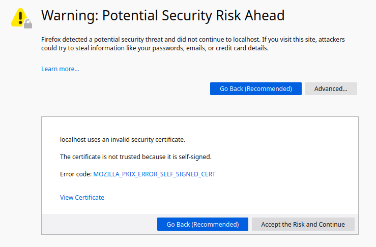
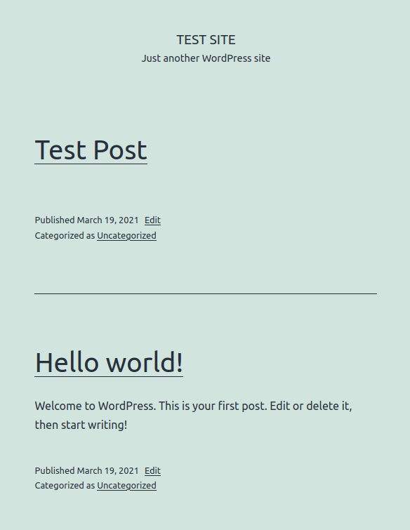

# ft_server
This is a sample nginx server that runs wordpress, phpMyAdmin, and an SQL database in a single docker container.<br>
It is only a sample and should not be used in production.

This sample server uses a self-signed SSL certificate and is run with autoindex that can be disabled.
> Due to security features and use of localhost, google chrome may not work. It is recommended to use firefox.

----
### Installation
```bash
https://github.com/AuroraSloan/ft_server.git
```

### Usage
Run the build.sh file to build the image and run the container.<br>
> With autoindex
```bash
bash build.sh
```
> Without autoindex
```bash
bash build.sh -off
```
----------
### Features
<br>Now you can open an internet browser and proceed to localhost:8080. Since the SSL certificate is self-signed, you will need click ```Advanced``` and ```Accept the Risk and Continue``` to access the above services.<br>
[security warning image](https://github.com/AuroraSloan/ft_server/blob/main/README.md#ssl)<br>
<br>Now you will be viewing either the autoindex page or general nginx index page depending on whether or not you chose to run the server with autoindex.<br>
[autoindex page image](https://github.com/AuroraSloan/ft_server/blob/main/README.md#index)<br>
<br>When first accessing https://localhost/wordpress, you will be redirected to a setup page. You can create the 'Site Title', 'Username', 'password', 'Email', etc to your liking and click ```Install WordPress```. Now log in as the user you just created. From here on, the wordpress dashboard is located at https://localhost/wordpress/wp-admin.<br>
[wordpress install image](https://github.com/AuroraSloan/ft_server/blob/main/README.md#wordpress)<br>
<br>After setting up wordpress, the database should be ready to go. Now you can login at https://localhost/phpmyadmin. The login information I have dedicated to phpmyadmin for this sample server is username: 'superuser' and password: 'password'. Again, this is not secure and is only meant to be a sample of how such a server would be set up.<br>
After logging in, you will be able to see the database created for this server 'ft_server_db' with all necessary tables.<br>
[phpmyadmin hompage image](https://github.com/AuroraSloan/ft_server/blob/main/README.md#phpmyadmin)<br>
<br>Now you can go to https://localhost/wordpress and see the sample site. Here or at https://localhost/wordpress/wp-admin, you can create posts, comments, pages, etc.<br>
[wordpress site](https://github.com/AuroraSloan/ft_server/blob/main/README.md#site)<br>
<br>After updating the site, you can refresh your phpmyadmin page and see the updated database tables.<br>
[phpmyadmin posts table image](https://github.com/AuroraSloan/ft_server/blob/main/README.md#table)<br>
<br>There are many things you can do as phpmyadmin and wordpress have been fully configured. Enjoy!<br>
<br>When you are finished, run the quit.sh file to stop the container and remove the image and container.
```bash
bash quit.sh
```

For more information on how to use docker and deal with containers and images, check out the wiki page.<br>
[Wiki](https://github.com/AuroraSloan/ft_server/wiki)

----
## Reference Images
##### SSL

##### INDEX

##### WORDPRESS

##### PHPMYADMIN

##### SITE

##### TABLE

