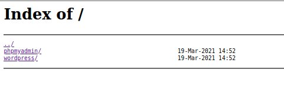
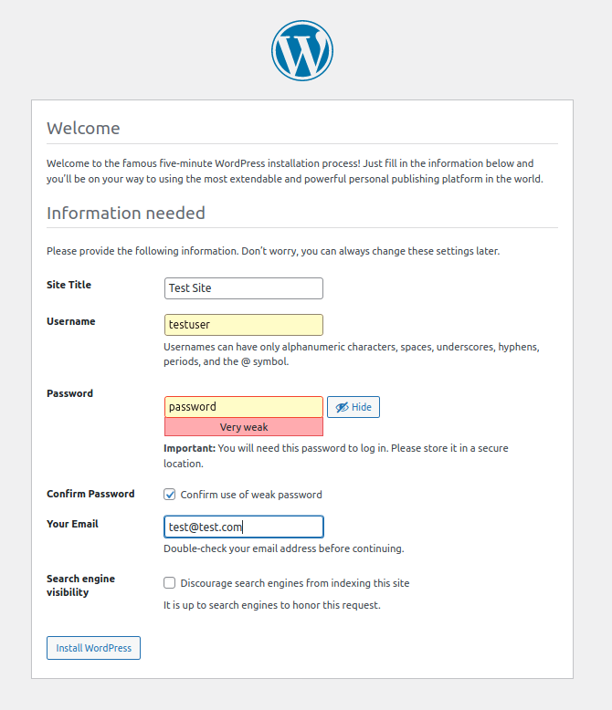
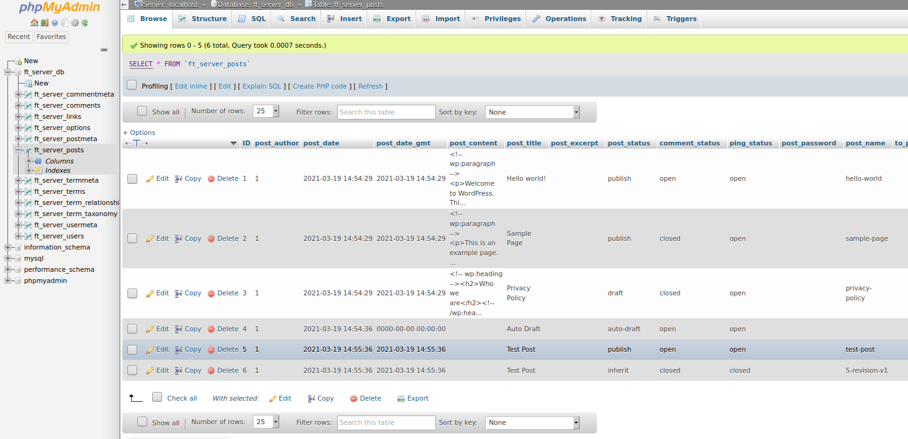

# ft_server
This is a sample nginx server that runs wordpress, phpMyAdmin, and an SQL database in a single docker container.

This sample server is SSL capable and is automatically run with an autoindex that can be disabled upon running the container. 

----
### Installation
```bash
https://github.com/AuroraSloan/ft_server.git
```

### Usage
Run the build.sh file to build the image and run the container.<br>
With autoindex
```bash
bash build.sh
```
without autoindex
```bash
bash build.sh -off
```
Now you can open an internet browser and proceed to localhost:8080. Since the SSL certificate is self-signed, you will need click 'Advanced' and 'Accept the Risk and Continue' to access the above services.<br>
[SSL](https://github.com/AuroraSloan/ft_server/blob/main/README.md#ssl)<br>
Now you will be viewing either the autoindex page or general nginx index page depending on whether or not you chose to run the server with autoindex.<br>
<br>
When first accessing localhost/wordpress, you will be redirected to a setup page. You can create the 'Site Title', 'Username', 'password', 'Email', etc to your liking and click 'Install WordPress'. Now log in as the user you just created. From here on, the wordpress dashboard is located at localhost/wordpress/wp-admin.<br>
<br>
After setting up wordpress, the database should be ready to go. Now you can login at localhost/phpmyadmin. The username and password I have dedicated to phpmyadmin for this sample server are username: 'superuser' and password: 'password'. Again, this is not secure and is only meant to be a sample of how such a server would be set up.<br>
After logging in, you will be able to see the database created for this server 'ft_server_db' with all necessary tables.<br>
<br>
Now you can go to localhost/wordpress and see the sample site. Here or at localhost/wordpress/wp-admin, you can create posts, comments, pages, etc.<br>
<br>
After updating the site, you can refresh your phpmyadmin page and see the updated database tables.<br>
<br>

Run the stop.sh file to stop the container and remove the image and container.
```bash
bash stop.sh
```

----
##### SSL

##### index

##### wordpress

##### phpmyadmin

##### test

##### post

